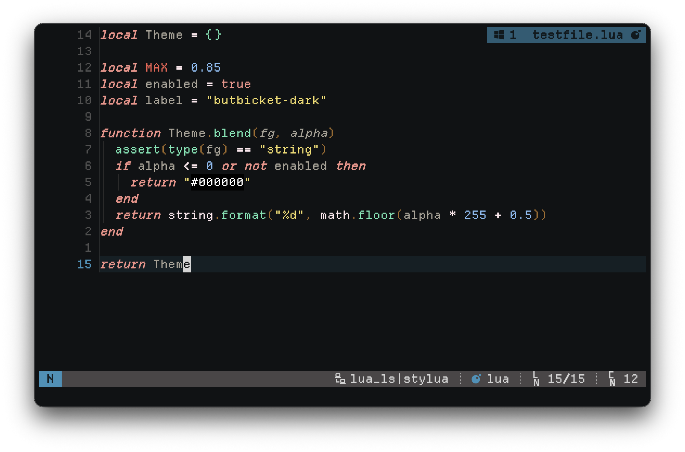
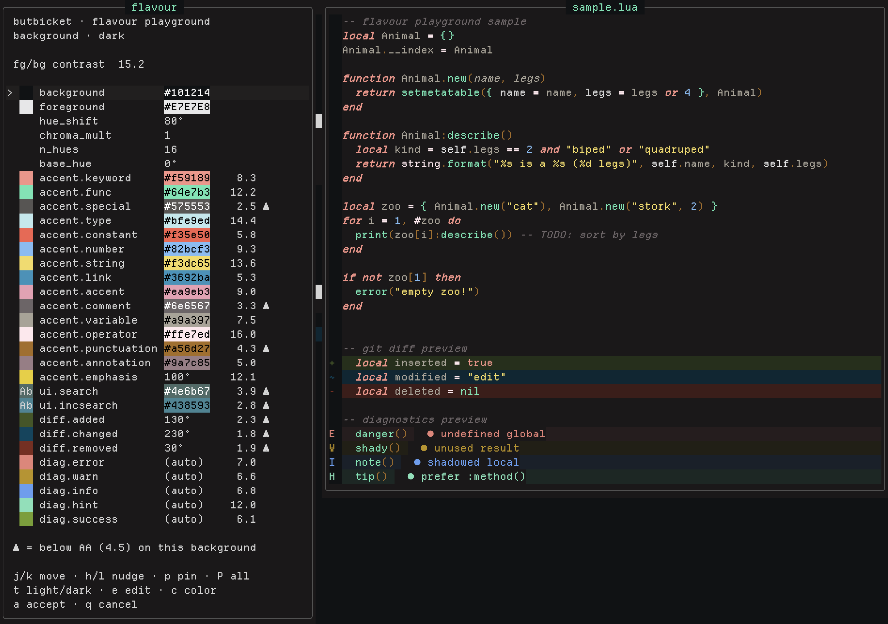

# ButBicket

A Neovim colorscheme inspired by the [Bitbucket](https://bitbucket.org) code-review
palette — the colors you stare at for hours reviewing pull requests, now in your
editor. Ships **dark** and **light** variants and integrates with a handful of
popular plugins.

---


*Canonical palette*

---


*With some playground tuning*

---

## Requirements

- Neovim >= 0.8
- `termguicolors` enabled (the colorscheme sets this for you)

## Installation

### lazy.nvim

```lua
{
  'svampkorg/butbicket',
  lazy = false,
  priority = 1000,
  config = function()
    require('butbicket').setup {} -- optional; see Configuration
    vim.cmd.colorscheme 'butbicket'
  end,
}
```

### packer.nvim

```lua
use {
  'svampkorg/butbicket',
  config = function()
    require('butbicket').setup {}
    vim.cmd.colorscheme 'butbicket'
  end,
}
```

## Usage

Pick a variant by setting the background before applying the colorscheme:

```lua
vim.o.background = 'dark' -- or 'light'
vim.cmd.colorscheme 'butbicket'
```

There are also explicit variant entrypoints:

```vim
colorscheme butbicket-dark
colorscheme butbicket-light
```

## Configuration

`setup {}` is optional. Defaults:

```lua
require('butbicket').setup {
  transparent = false, -- use the terminal background instead of a solid color
  italics = {
    comments = true,
    keywords = true,
    functions = false,
    strings = false,
    variables = false,
    variable_members = false,
    variable_parameters = true,
    statements = true,
    bufferline = false,
  },
  integrations = { default = true }, -- see Integrations
  flavour = false, -- see Flavours
  overrides = {}, -- table, or a function returning a table, of highlight groups
}
```

### Overriding highlights

```lua
require('butbicket').setup {
  overrides = {
    Comment = { fg = '#808080', italic = false },
    ['@variable'] = { fg = '#c0c0c0' },
  },
}
```

## Integrations

Integrations are **auto-detected**: a plugin's highlights are only applied when
that plugin is actually installed, so leaving them all on is safe and keeps
`:hi` uncluttered. Each is also toggleable via `config.integrations`.

Dedicated support ships for: nvim-cmp, blink.cmp, neogit, flash.nvim,
arrow.nvim, snacks (indent, picker, dashboard), haunt, telescope, nvim-tree,
neo-tree, diffview, which-key, todo-comments, gitsigns, treesitter-context,
lazy.nvim, nvim-dap (+ dap-view, dap-virtual-text), grug-far, codecompanion,
vim-fugitive, vim-matchup, mini.\* (files, pick, indentscope, hipatterns, icons,
notify, statusline, cursorword, tabline, …), render-markdown, and bufferline.

`integrations.default` sets the fallback for every integration; individual names
override it:

```lua
require('butbicket').setup {
  integrations = {
    default = true,     -- apply any installed integration (the default)
    telescope = false,  -- …except opt out of specific ones
  },
}

-- Or opt in to only a chosen few:
require('butbicket').setup {
  integrations = { default = false, gitsigns = true, cmp = true },
}
```

**lualine** — a theme is provided (`lua/lualine/themes/butbicket.lua`):

```lua
require('lualine').setup { options = { theme = 'butbicket' } }
```

**bufferline** — after `setup {}`, apply the generated highlights:

```lua
require('butbicket').setup {}
require('bufferline').setup {
  highlights = require('butbicket').bufferline.highlights,
}
```

## Flavours

A **flavour** re-tones the whole palette onto a new background/foreground while
keeping ButBicket's structure and hue relationships (functions, keywords, etc.
stay recognisably themselves). It is opt-in and off by default. Colors are
remapped perceptually in OKLab, so contrast stays sensible.

```lua
require('butbicket').setup {
  flavour = {
    background = '#0d1b2a', -- new base background
    foreground = '#e2e8f4', -- new base foreground
    hue_shift = -8,         -- optional: rotate every hue (degrees)
    chroma_mult = 1.0,      -- optional: scale saturation
  },
}
```

### Accent hues

Beyond re-basing, you can reshape the accent hues (mini.hues style). This only
touches syntax-identity roles — diagnostic/diff colors stay red/green/blue.

`n_hues` snaps every accent role to the nearest of N hues spread evenly around
the wheel (`0` = grayscale accents), and `base_hue` rotates where they start:

```lua
flavour = {
  background = '#101214',
  foreground = '#e7e7e8',
  n_hues = 3,      -- triadic; 0 = monochrome accents
  base_hue = 20,   -- optional: degrees the hue slots start at
}
```

`accents` pins individual roles, and any role you don't list is generated as
normal. A pin is either:

- a **hex string** — the role takes that exact color (lightness, chroma, and
  hue), so a color you picked lands verbatim; or
- a **number** — a hue angle in degrees; only the hue moves, each role keeps its
  own lightness/chroma (grading preserved).

Syntax roles: `keyword`, `func`, `special`, `type`, `constant` (Constant/
Conditional/Exception — syntax red), `number`, `string`, `link`, `accent`,
`comment`, `variable`, `operator`, `punctuation` (brackets/delimiters),
`annotation` (attributes/decorators like `@override`), `emphasis` (the accent
yellow — match highlights, icons, prompt keys). UI-background roles: `search`
(`Search` + `CurSearch`, and flash's current-match label) and `incsearch`
(`IncSearch` + `Substitute`). Each search role has its own palette base.

Locked identity roles: `added`, `changed`, `removed` (diff, green/blue/red) and
`error`, `warn`, `info`, `hint`, `success` (diagnostics/status). These are
**locked** — `hue_shift`/`chroma_mult`/`n_hues`/`base_hue` never move them (only
their lightness remaps to fit a new background), so a diff stays green/blue/red
and an error stays red whatever you do to the wheel. They change only when you
pin one explicitly, and a pin flows through the whole family: for diff, the
sign/text foreground and the derived line backgrounds; for a diagnostic, every
`Diagnostic*`/`*Msg` group plus the `errorText`/`warningText`/`successText`
integration colors. Each diagnostic level owns a dedicated palette key.

```lua
flavour = {
  background = '#101214',
  foreground = '#e7e7e8',
  accents = {
    keyword = '#c678dd', -- exact color
    string  = 145,       -- hue angle only (keeps string's lightness/chroma)
    comment = 210,
  },
}
```

**Light and dark.** A flat `flavour` like the above targets a single background;
it applies only on the polarity its `background` implies (dark here), and the
other side renders canonical butbicket — so `:set background=light` /
`:colorscheme butbicket-light` still switches. To carry a re-tone into *both*,
give each background its own recipe:

```lua
flavour = {
  dark  = { background = '#101214', foreground = '#e7e7e8', hue_shift = 30 },
  light = { background = '#fafaf7', foreground = '#202020', hue_shift = 30 },
}
```

Either side may be omitted (that background then stays canonical). The playground
(below) can tune both and copies this shape.

Preview generated flavours (including the `n_hues`/`accents` samples) without
changing anything:

```sh
nvim -l scripts/gen-flavour.lua
```

### Flavour playground


*The ButBicket playground, some roles pinned, some rotated. Some still auto
(affected by the global settings further up in the flavour window)*

`:ButbicketFlavour` opens a live editor: a control panel with every flavour knob
(background/foreground, `hue_shift`, `chroma_mult`, `n_hues`, `base_hue`, and the
per-role accents, plus the `search`/`incsearch` background roles) beside a sample
buffer that recolors instantly as you tune. Foreground knobs show a solid swatch;
the background roles show sample text (`Ab`) painted on the color so you can see
the fg/bg contrast. Each shows its WCAG contrast (color-on-background for syntax,
text-on-color for the background roles), flagged `⚠` below AA. Locked identities
are grouped as `diff.*` and `diag.*`. The sample ends with a git-diff and a
diagnostics preview (line backgrounds, gutter signs, virtual-text messages) so
those roles are visible too. If a flavour is already set (in `setup{}` or from a
previous accept), the playground opens with those values instead of from scratch.

`t` toggles the preview between dark and light. Each background has its own
recipe; the first switch to a side seeds it from the side you were on (same
hue_shift/chroma/accents/pins, re-anchored to that base) and it diverges as you
edit. `a` copies both sides as `flavour = { dark = {…}, light = {…} }` (only the
sides you touched).

The panel and sample size to their content, capped to the window. Neovim floats
have no scrollbar; when the knob list is taller than the screen it scrolls with
the focused knob and the panel footer shows how many rows are hidden (`↑ n` /
`n ↓`).

| key       | action                                                |
| --------- | ----------------------------------------------------- |
| `j` / `k` | move between knobs                                     |
| `h` / `l` | nudge the focused knob (hex knobs nudge lightness)     |
| `e`       | type a value (hex, degrees, or `auto` to clear)        |
| `c`       | open the OKLch color editor for a color knob           |
| `p`       | pin the focused accent at its current color (press again to unpin) |
| `P`       | pin every unpinned accent at its current color         |
| `t`       | toggle the preview background light/dark — each side keeps its own recipe |
| `a`       | accept — copy a paste-ready `flavour = { … }` and keep it applied |
| `q`       | cancel — restore the previous look                     |

The color editor (`c`, for background/foreground/accents) has an editable hex
field with L/C/H channel rows you nudge with `h`/`l`. The hex is plain buffer
text, so an external color picker — e.g. [ccc.nvim](https://github.com/uga-rosa/ccc.nvim)
(`:CccPick`) or [oklch-color-picker](https://github.com/eero-lehtinen/oklch-color-picker.nvim)
(`pick_under_cursor()`) — run with the cursor on it updates the color just like
any buffer edit.

`p` freezes an accent at the exact color its swatch shows (an exact-hex pin, so
`hue_shift`/`base_hue`/`n_hues` no longer move it): spin the global hue wheel to
place the unpinned roles, `p` each one you like, then keep spinning the rest.
`P` pins them all at once. `p` again on a pinned role clears it back to auto.

Accept copies the block to the `+` register; paste it into your `setup{}` to make
it permanent.

The live preview applies **silently** (no `ColorScheme` event) while you edit —
opening the playground and every knob nudge re-tone without firing the event, so
a `ColorScheme` autocmd doesn't thrash on each keystroke. The playground fires
`ColorScheme` **once** only when the applied palette genuinely changes: the `t`
light/dark toggle, and on exit (accept or cancel). So any `ColorScheme` autocmd
you rely on re-runs against the new palette (e.g. refreshing a winbar plugin like
incline). `:ButbicketExtras` behaves the same — its internal background flips are
silent and it fires `ColorScheme` once when done.

There is no default keymap — bind `<Plug>(butbicket-flavour)` if you want one:

```lua
vim.keymap.set("n", "<leader>bf", "<Plug>(butbicket-flavour)")
```

## Extras — terminal, bat & Claude Code themes

ButBicket also themes tools outside the editor, generated from the same 16-color
palette and committed under `extras/` (one directory per target). What it can
and can't theme:

- **Terminals** — full palette, exact match.
- **bat** — full palette (a real Sublime/`.tmTheme`).
- **Claude Code** — its UI chrome takes the palette; its *code* syntax
  highlighting can't (highlight.js won't load custom themes — see below).

### Terminal themes

Generated for **Alacritty, Ghostty, Kitty, WezTerm, and Warp**:

```
extras/alacritty/   extras/ghostty/   extras/kitty/   extras/wezterm/   extras/warp/
```

Point your terminal at the relevant file:

- **Alacritty**: `[general] import = ["/path/to/extras/alacritty/butbicket-dark.toml"]`
- **Ghostty**: `theme = /path/to/extras/ghostty/butbicket-dark`
- **Kitty**: `include /path/to/extras/kitty/butbicket-dark.conf`
- **WezTerm**: copy into `~/.config/wezterm/colors/` and `config.color_scheme = 'butbicket-dark'`
- **Warp**: copy into `~/.warp/themes/`

The scheme also exports the palette to `vim.g.terminal_color_*` for `:terminal`.
The ANSI slot mapping is aesthetic (chosen to look right in a shell), not a
literal red/green/blue mapping — e.g. slot 4 carries a mint tone — and mirrors
`set_terminal_colors()` in `lua/butbicket/init.lua`, so `:terminal` inside Neovim
and your host terminal stay in sync.

Regenerate the committed themes (all, or a subset):

```sh
nvim -l scripts/gen-terminals.lua              # all terminals, both variants
nvim -l scripts/gen-terminals.lua dark         # all terminals, dark only
nvim -l scripts/gen-terminals.lua dark kitty   # dark, kitty only
```

### bat

`extras/bat/butbicket-*.tmTheme` is a genuine bat/Sublime theme:

```sh
cp extras/bat/*.tmTheme "$(bat --config-dir)/themes/" && bat cache --build
bat --theme=butbicket-dark file.lua
```

### Claude Code

`extras/claude-code/butbicket-*.json` themes Claude Code's **UI chrome** (diffs,
borders, status, accent). Copy to `~/.claude/themes/`, then set
`"theme": "custom:butbicket-dark"` in `~/.claude/settings.json`.

Code **syntax highlighting** is separate. Claude Code colors code with an
internal engine (highlight.js) that accepts only built-in theme names via
`CLAUDE_CODE_SYNTAX_HIGHLIGHT` (`Monokai Extended`, `GitHub`, `ansi`) and loads
no custom themes — so the butbicket palette can't reach code blocks. Pick
`ansi` (on-palette from your terminal's ANSI slots, but coarse — comments can't
be dimmed) or `Monokai Extended` (off-palette, but separates tokens properly):

```jsonc
// ~/.claude/settings.json  (restart Claude Code after changing)
"env": { "CLAUDE_CODE_SYNTAX_HIGHLIGHT": "Monokai Extended" }
```

### Match a flavour

The committed `extras/` reflect the canonical palette. If you run a `flavour`,
regenerate matching extras from your live config:

```vim
:ButbicketExtras            " -> stdpath('data')/butbicket/extras, both variants
:ButbicketExtras ~/themes   " -> a directory of your choice
```

It reads whatever `flavour` is active in your `setup{}` and emits every target
(terminals + bat + Claude Code) for **both** dark and light into
`<dir>/<target>/butbicket-<bg>.*`. A per-background flavour
(`{ dark = …, light = … }`) emits each side with its own recipe; a flat flavour
applies on its polarity and the other side stays canonical. The default dir
lives under Neovim's data dir (e.g. `~/.local/share/nvim/butbicket/extras`) — a
stable location that survives plugin updates and is regenerated in place, so a
terminal/bat config you symlink there picks up new colors each run. It never
touches the plugin's git-tracked `extras/`.

## Acknowledgements

- **[mini.nvim](https://github.com/nvim-mini/mini.nvim)** by Evgeni Chasnovski
  (MIT):
  - `mini.colors` — the OKLab/OKLch conversion math and gamut clipping in
    `lua/butbicket/oklab.lua`, which carries the full attribution inline. Those
    conversions originate with
    [Björn Ottosson](https://bottosson.github.io/posts/oklab/).
  - `mini.hues` — inspiration for the accent-hue generator (`n_hues` / `base_hue`
    slot snapping) in `lua/butbicket/flavour.lua`.
- Palette inspired by [Bitbucket](https://bitbucket.org)'s code-review UI.

## Contributing

See [CONTRIBUTING.md](CONTRIBUTING.md). In short: run `stylua .` and `nvim -l
tests/run.lua` before opening a PR.

## License

[MIT](LICENSE)
