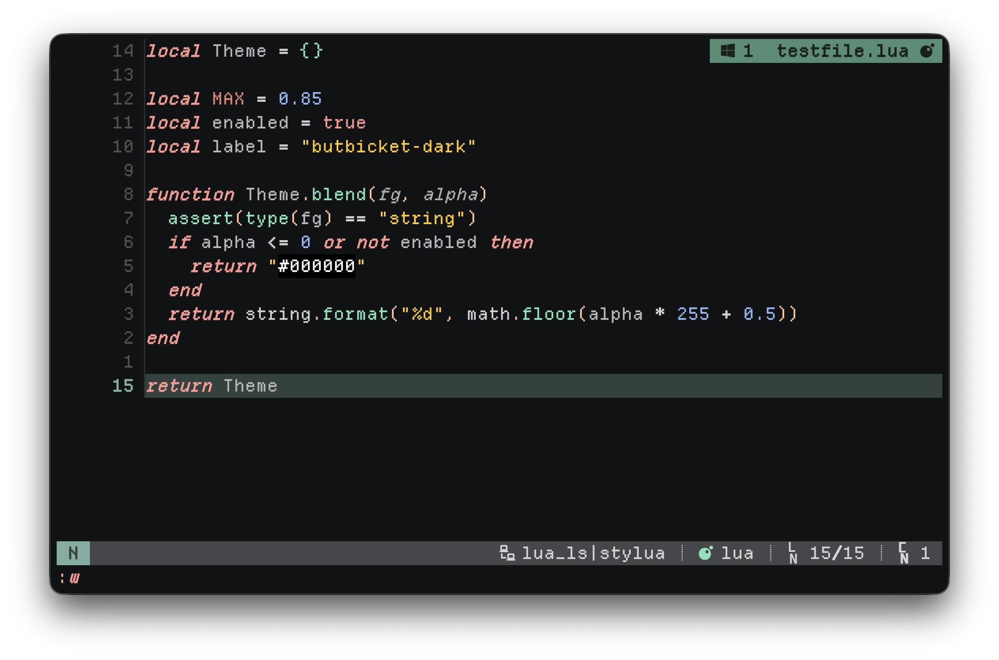

# ButBicket

A Neovim colorscheme inspired by the [Bitbucket](https://bitbucket.org) code-review
palette — the colors you stare at for hours reviewing pull requests, now in your
editor. Ships **dark** and **light** variants and integrates with a handful of
popular plugins.



## Requirements

- Neovim >= 0.8
- `termguicolors` enabled (the colorscheme sets this for you)

## Installation

### lazy.nvim

```lua
{
  'svampkorg/butbicket',
  lazy = false,
  priority = 1000,
  config = function()
    require('butbicket').setup {} -- optional; see Configuration
    vim.cmd.colorscheme 'butbicket'
  end,
}
```

### packer.nvim

```lua
use {
  'svampkorg/butbicket',
  config = function()
    require('butbicket').setup {}
    vim.cmd.colorscheme 'butbicket'
  end,
}
```

## Usage

Pick a variant by setting the background before applying the colorscheme:

```lua
vim.o.background = 'dark' -- or 'light'
vim.cmd.colorscheme 'butbicket'
```

There are also explicit variant entrypoints:

```vim
colorscheme butbicket-dark
colorscheme butbicket-light
```

## Configuration

`setup {}` is optional. Defaults:

```lua
require('butbicket').setup {
  transparent = false, -- use the terminal background instead of a solid color
  italics = {
    comments = true,
    keywords = true,
    functions = false,
    strings = false,
    variables = false,
    variable_members = false,
    variable_parameters = true,
    statements = true,
    bufferline = false,
  },
  integrations = { default = true }, -- see Integrations
  flavour = false, -- see Flavours
  overrides = {}, -- table, or a function returning a table, of highlight groups
}
```

### Overriding highlights

```lua
require('butbicket').setup {
  overrides = {
    Comment = { fg = '#808080', italic = false },
    ['@variable'] = { fg = '#c0c0c0' },
  },
}
```

## Integrations

Integrations are **auto-detected**: a plugin's highlights are only applied when
that plugin is actually installed, so leaving them all on is safe and keeps
`:hi` uncluttered. Each is also toggleable via `config.integrations`.

Dedicated support ships for: nvim-cmp, blink.cmp, neogit, flash.nvim,
arrow.nvim, snacks (indent, picker, dashboard), haunt, telescope, nvim-tree,
neo-tree, diffview, which-key, todo-comments, gitsigns, treesitter-context,
lazy.nvim, nvim-dap (+ dap-view, dap-virtual-text), grug-far, codecompanion,
vim-fugitive, vim-matchup, mini.\* (files, pick, indentscope, hipatterns, icons,
notify, statusline, cursorword, tabline, …), render-markdown, and bufferline.

`integrations.default` sets the fallback for every integration; individual names
override it:

```lua
require('butbicket').setup {
  integrations = {
    default = true,     -- apply any installed integration (the default)
    telescope = false,  -- …except opt out of specific ones
  },
}

-- Or opt in to only a chosen few:
require('butbicket').setup {
  integrations = { default = false, gitsigns = true, cmp = true },
}
```

**lualine** — a theme is provided (`lua/lualine/themes/butbicket.lua`):

```lua
require('lualine').setup { options = { theme = 'butbicket' } }
```

**bufferline** — after `setup {}`, apply the generated highlights:

```lua
require('butbicket').setup {}
require('bufferline').setup {
  highlights = require('butbicket').bufferline.highlights,
}
```

## Flavours

A **flavour** re-tones the whole palette onto a new background/foreground while
keeping ButBicket's structure and hue relationships (functions, keywords, etc.
stay recognisably themselves). It is opt-in and off by default. Colors are
remapped perceptually in OKLab, so contrast stays sensible.

```lua
require('butbicket').setup {
  flavour = {
    background = '#0d1b2a', -- new base background
    foreground = '#e2e8f4', -- new base foreground
    hue_shift = -8,         -- optional: rotate every hue (degrees)
    chroma_mult = 1.0,      -- optional: scale saturation
  },
}
```

### Accent hues

Beyond re-basing, you can reshape the accent hues (mini.hues style). This only
touches syntax-identity roles — diagnostic/diff colors stay red/green/blue.

`n_hues` snaps every accent role to the nearest of N hues spread evenly around
the wheel (`0` = grayscale accents), and `base_hue` rotates where they start:

```lua
flavour = {
  background = '#101214',
  foreground = '#e7e7e8',
  n_hues = 3,      -- triadic; 0 = monochrome accents
  base_hue = 20,   -- optional: degrees the hue slots start at
}
```

`accents` pins individual roles, and any role you don't list is generated as
normal. A pin is either:

- a **hex string** — the role takes that exact color (lightness, chroma, and
  hue), so a color you picked lands verbatim; or
- a **number** — a hue angle in degrees; only the hue moves, each role keeps its
  own lightness/chroma (grading preserved).

Roles: `keyword`, `func`, `special`, `type`, `number`, `string`, `link`,
`accent`, `comment`, `variable`, `operator`. (Diagnostic/diff colors are never
re-hued.)

```lua
flavour = {
  background = '#101214',
  foreground = '#e7e7e8',
  accents = {
    keyword = '#c678dd', -- exact color
    string  = 145,       -- hue angle only (keeps string's lightness/chroma)
    comment = 210,
  },
}
```

Preview generated flavours (including the `n_hues`/`accents` samples) without
changing anything:

```sh
nvim -l scripts/gen-flavour.lua
```

### Flavour playground

`:ButbicketFlavour` opens a live editor: a control panel with every flavour knob
(background/foreground, `hue_shift`, `chroma_mult`, `n_hues`, `base_hue`, and the
per-role accents) beside a sample buffer that recolors instantly as you tune. Every
color knob shows a live swatch, and each accent shows its WCAG contrast against the
background, flagged `⚠` below AA. If a flavour is already set (in `setup{}` or from
a previous accept), the playground opens with those values instead of from scratch.

| key       | action                                                |
| --------- | ----------------------------------------------------- |
| `j` / `k` | move between knobs                                     |
| `h` / `l` | nudge the focused knob (hex knobs nudge lightness)     |
| `e`       | type a value (hex, degrees, or `auto` to clear)        |
| `c`       | open the OKLch color editor for a color knob           |
| `p`       | pin the focused accent at its current color (press again to unpin) |
| `P`       | pin every unpinned accent at its current color         |
| `a`       | accept — copy a paste-ready `flavour = { … }` and keep it applied |
| `q`       | cancel — restore the previous look                     |

The color editor (`c`, for background/foreground/accents) has an editable hex
field with L/C/H channel rows you nudge with `h`/`l`. The hex is plain buffer
text, so an external color picker — e.g. [ccc.nvim](https://github.com/uga-rosa/ccc.nvim)
(`:CccPick`) or [oklch-color-picker](https://github.com/eero-lehtinen/oklch-color-picker.nvim)
(`pick_under_cursor()`) — run with the cursor on it updates the color just like
any buffer edit.

`p` freezes an accent at the exact color its swatch shows (an exact-hex pin, so
`hue_shift`/`base_hue`/`n_hues` no longer move it): spin the global hue wheel to
place the unpinned roles, `p` each one you like, then keep spinning the rest.
`P` pins them all at once. `p` again on a pinned role clears it back to auto.

Accept copies the block to the `+` register; paste it into your `setup{}` to make
it permanent. On exit (accept or cancel) the playground fires a `ColorScheme`
event once, so any `ColorScheme` autocmd you rely on re-runs against the final
palette (e.g. refreshing a winbar plugin like incline). It is *not* fired on each
live change, to avoid thrashing such listeners while you tune.

There is no default keymap — bind `<Plug>(butbicket-flavour)` if you want one:

```lua
vim.keymap.set("n", "<leader>bf", "<Plug>(butbicket-flavour)")
```

## Terminal colors

The scheme exports a 16-color palette to `vim.g.terminal_color_*`. Matching
terminal themes are generated from that same palette and committed under
`extras/`, one directory per terminal:

```
extras/ghostty/    extras/kitty/    extras/alacritty/    extras/wezterm/    extras/warp/
```

Regenerate them all (or a subset):

```sh
nvim -l scripts/gen-terminals.lua              # all terminals, both variants
nvim -l scripts/gen-terminals.lua dark         # both terminals, dark only
nvim -l scripts/gen-terminals.lua dark kitty   # dark, kitty only
```

### Match a flavour

The committed `extras/` are the canonical palette. If you run a `flavour`, the
files above won't match it — regenerate them from your live config with:

```vim
:ButbicketExtras            " -> stdpath('data')/butbicket/extras, current background
:ButbicketExtras ~/themes   " -> a directory of your choice
```

It reads whatever `flavour` is active in your `setup{}` and emits every target
(terminals + bat + Claude Code) into `<dir>/<target>/butbicket-<bg>.*`, matching
your editor. The default lives under Neovim's data dir (e.g.
`~/.local/share/nvim/butbicket/extras`) — a stable location that survives plugin
updates and is regenerated in place, so a terminal/bat config you symlink there
picks up new colors every time you re-run the command. (It deliberately does
**not** touch the plugin's own git-tracked `extras/`.) Point your terminal/bat at
those files instead of the repo ones.

Then point your terminal at the relevant file, e.g.:

- **Ghostty**: `theme = /path/to/extras/ghostty/butbicket-dark`
- **Kitty**: `include /path/to/extras/kitty/butbicket-dark.conf`
- **Alacritty**: `[general] import = ["/path/to/extras/alacritty/butbicket-dark.toml"]`
- **WezTerm**: copy into `~/.config/wezterm/colors/` and `config.color_scheme = 'butbicket-dark'`
- **Warp**: copy into `~/.warp/themes/`

Note: the ANSI slot mapping is aesthetic (chosen to look right in a shell), not a
literal red/green/blue mapping — e.g. slot 4 carries a mint tone. It mirrors
`set_terminal_colors()` in `lua/butbicket/init.lua`, so `:terminal` inside Neovim
and your host terminal stay in sync.

## Claude Code

The generator emits two kinds of artifact under `extras/` (dark + light):

**UI chrome** — `extras/claude-code/butbicket-*.json` is a Claude Code custom
theme (diffs, borders, status, accent). Copy to `~/.claude/themes/`, then set
`"theme": "custom:butbicket-dark"` in `~/.claude/settings.json`.

**Code syntax highlighting.** Claude Code highlights code with an internal
engine (highlight.js), *not* bat — it only accepts a small set of built-in
theme names via `CLAUDE_CODE_SYNTAX_HIGHLIGHT` (`Monokai Extended`, `GitHub`,
`ansi`), and does **not** load custom `.tmTheme` files.

```jsonc
// ~/.claude/settings.json  (restart Claude Code after changing)
"env": { "CLAUDE_CODE_SYNTAX_HIGHLIGHT": "Monokai Extended" }
```

- `ansi` colours code from the terminal's ANSI slots 0–15 — on-palette if your
  terminal runs a butbicket theme, but **coarse**: highlight.js collapses
  keyword/comment/number onto a single ANSI slot, and comments can't be dimmed.
- `Monokai Extended` gives proper token separation (dim comments, distinct
  keyword/string/number) at the cost of not being the butbicket palette.

There's no way to get the full butbicket treesitter palette into Claude Code's
code blocks — pick on-palette-but-coarse (`ansi`) or readable-but-off-palette
(`Monokai Extended`).

**`extras/bat/butbicket-*.tmTheme`** is a genuine bat/Sublime theme for actual
`bat` usage in the terminal (`bat --theme=butbicket-dark`); install with
`cp extras/bat/*.tmTheme "$(bat --config-dir)/themes/" && bat cache --build`.
It is *not* used by Claude Code.

## Contributing

See [CONTRIBUTING.md](CONTRIBUTING.md). In short: run `stylua .` and `nvim -l
tests/run.lua` before opening a PR.

## License

[MIT](LICENSE)
